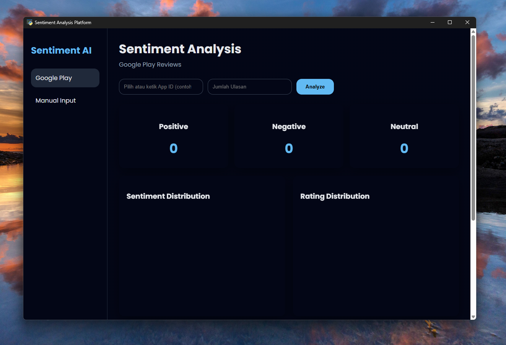
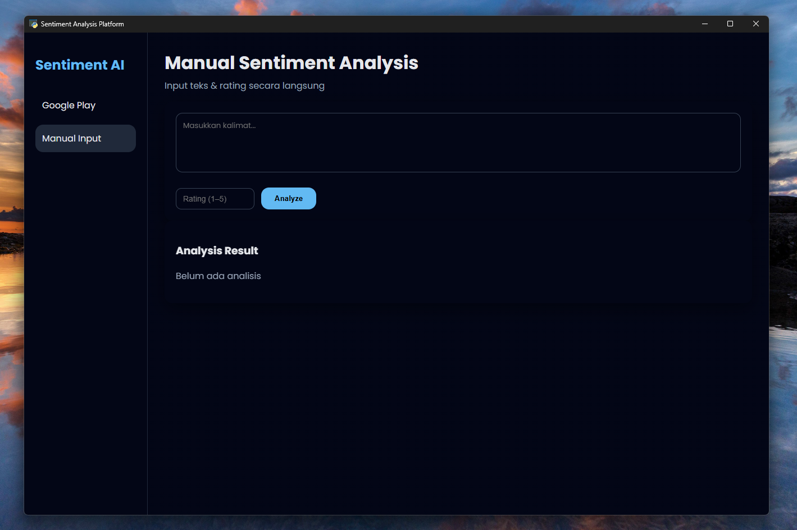
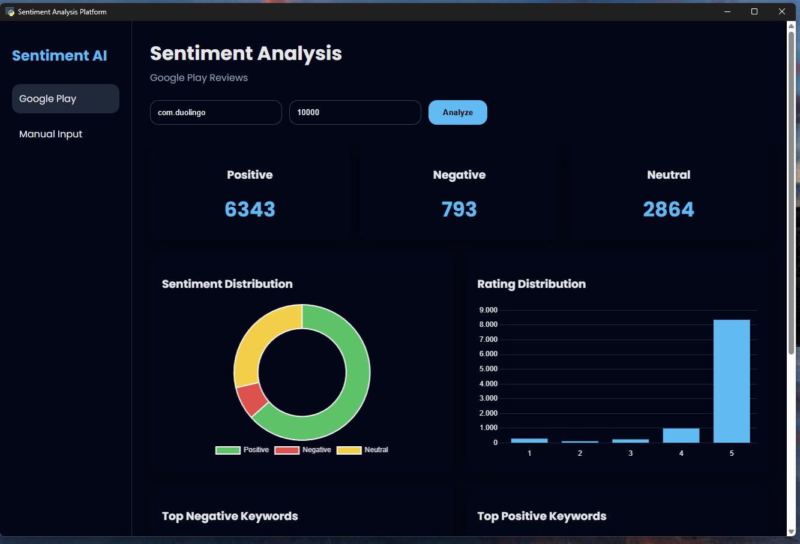
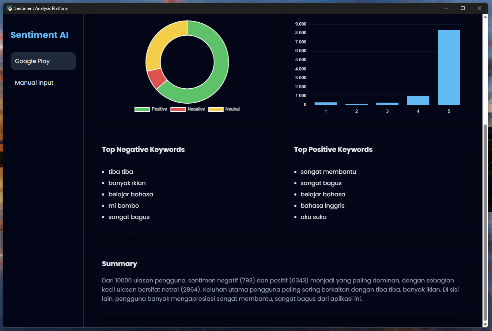
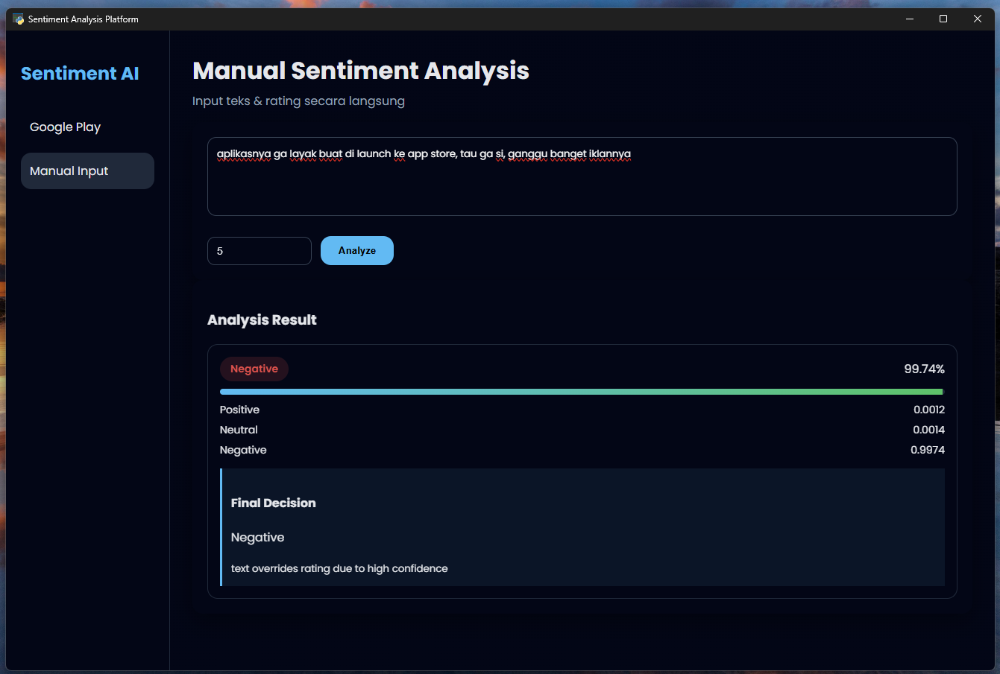
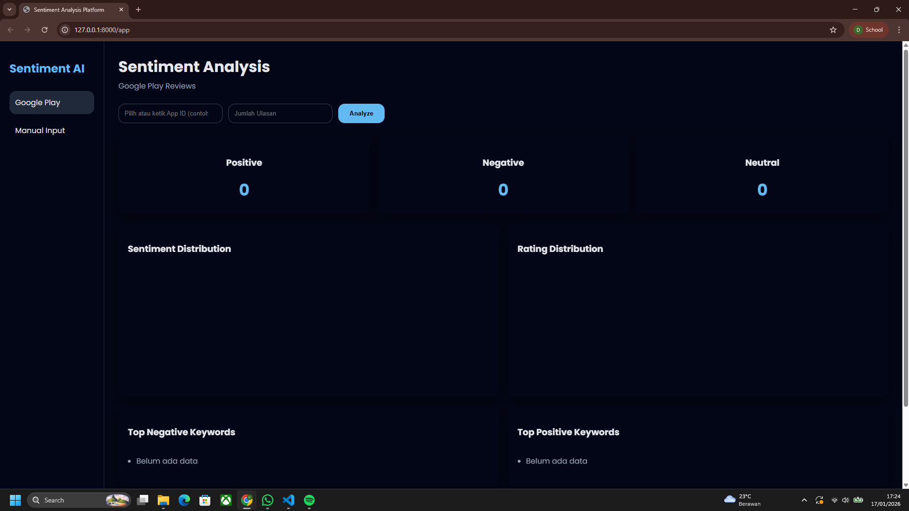
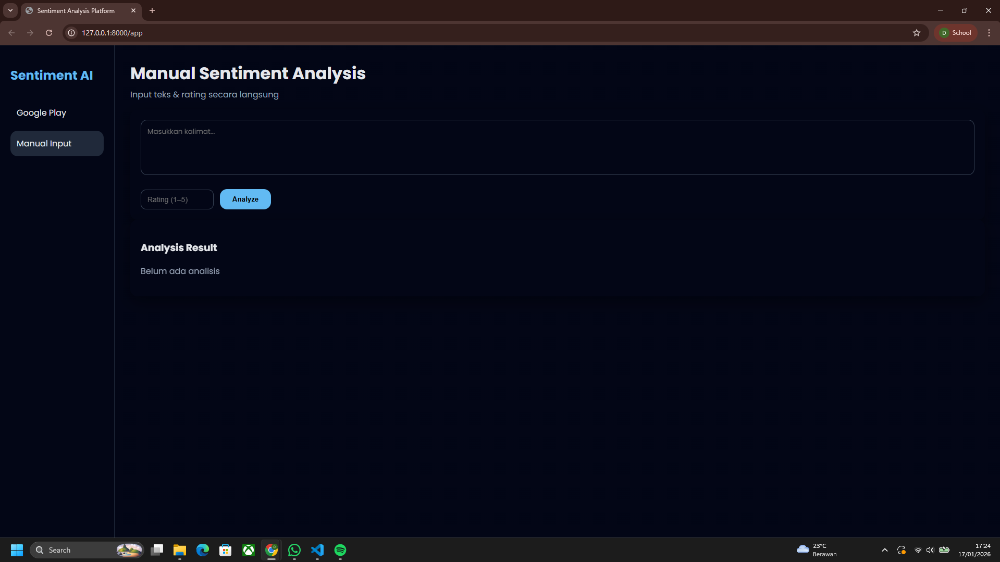
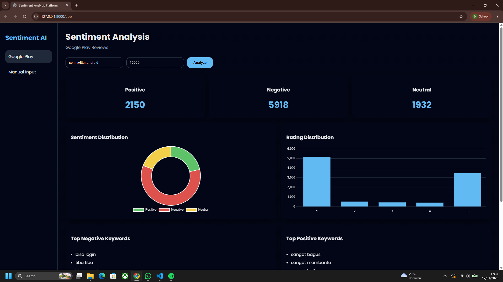
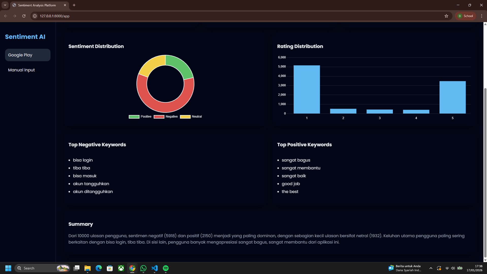
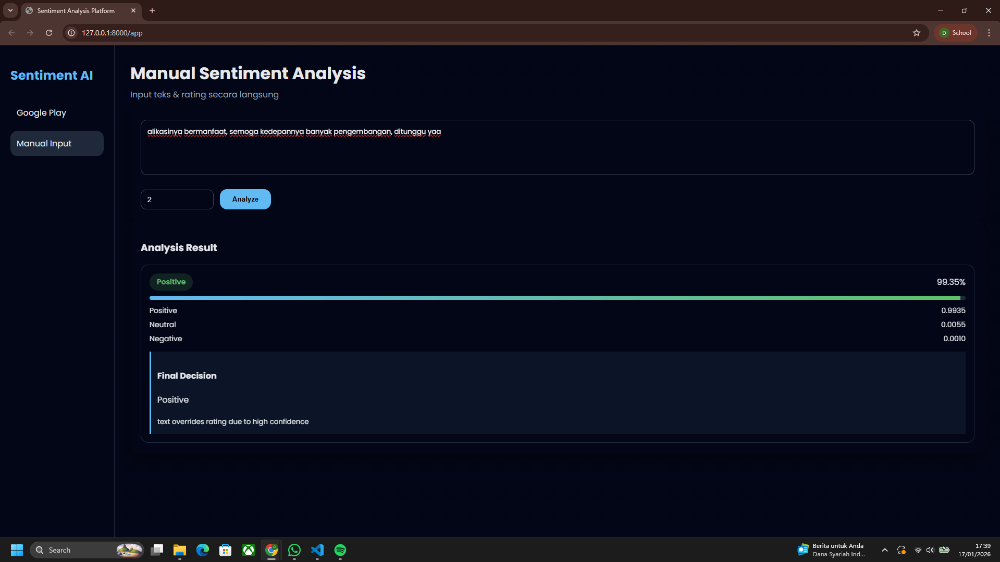

# SentimentAI

**Author:** Dzacky Ahmad

---

## Overview

**SentimentAI** is an end-to-end Sentiment Analysis application designed for **Indonesian-language text**. The system analyzes user sentiment from two primary sources:

1. **Google Play Store reviews** (automatic scraping)
2. **Manual text input** with optional star rating (1–5)

The application is available in **two formats**:

* **Web Application**
* **Desktop Application (.exe)**

SentimentAI is built for academic research, product evaluation, and portfolio demonstration, combining **NLP**, **machine learning**, and a **modern interactive UI**.

---

## Key Features

### Google Play Review Analysis

* Scrapes real user reviews from Google Play Store
* Automatic sentiment classification:

  * Positive
  * Negative
  * Neutral
* Rating distribution visualization (1–5 stars)
* Insight generation:

  * Top positive keywords
  * Top negative keywords
* Automatic summary generation

### Manual Sentiment Analysis

* Manual text input
* Optional star rating (1–5)
* Sentiment prediction using IndoBERT-based model
* Confidence score and probability distribution
* Final sentiment decision using decision engine

### Visualization & UI

* Interactive dashboard
* Doughnut chart for sentiment distribution
* Bar chart for rating distribution
* Keyword insight panels
* Clean, dark-themed modern UI

---

## Application Results & Screenshots

### Desktop Application — Google Play Dashboard



### Desktop Application — Manual Sentiment Analysis



### Desktop Application — Google Play Test (1)



### Desktop Application — Google Play Test (2)



### Desktop Application — Manual Test



---

### Web Application — Google Play Dashboard



### Web Application — Manual Sentiment Dashboard



### Web Application — Google Play Test (1)



### Web Application — Google Play Test (2)



### Web Application — Manual Test



---

## Project Structure

```
ANALISIS-SENTIMEN/
│
├── analysis/              # NLP, sentiment model, insight generation
├── api/                   # FastAPI backend
│   └── ui/                # Frontend (HTML, CSS, JS)
├── scraper/               # Google Play scraper
├── data/                  # Raw, processed, and insight data
├── img/                   # Documentation screenshots
├── build/                 # PyInstaller build artifacts
├── dist/                  # Generated .exe files
├── desktop_app.py         # Desktop application entry point
├── run_app.py             # Web application entry point
├── requirements.txt
├── SentimentAI.spec
└── README.md
```

---

## How to Run (Without Build)

### Run as Web Application

```bash
python run_app.py
```

Then open:

```
http://127.0.0.1:8000/app
```

### Run as Desktop Application

```bash
python desktop_app.py
```

---

## Build Executable (.exe)

### Desktop Application (.exe)

```bash
pyinstaller --noconfirm --onefile --name SentimentAI \
--add-data "api;api" \
--add-data "analysis;analysis" \
--add-data "scraper;scraper" \
--add-data "data;data" \
--hidden-import fastapi \
--hidden-import uvicorn \
--hidden-import sklearn \
--hidden-import torch \
--hidden-import transformers \
--hidden-import google_play_scraper \
desktop_app.py
```

### Web Application (.exe)

```bash
pyinstaller --onefile --name SentimentAI \
--add-data "api;api" \
--add-data "analysis;analysis" \
--add-data "scraper;scraper" \
--hidden-import fastapi \
--hidden-import fastapi.staticfiles \
--hidden-import uvicorn \
--hidden-import sklearn \
--hidden-import sklearn.feature_extraction.text \
--hidden-import torch \
--hidden-import transformers \
--hidden-import google_play_scraper \
--hidden-import google_play_scraper.reviews \
--hidden-import google_play_scraper.constants \
run_app.py
```

The generated executable will be located in the `dist/` folder.

---

## Notes

* The `.exe` file **should NOT be uploaded to GitHub**.
* Only source code, configuration files, and documentation should be committed.
* Use GitHub Releases or external storage if you want to distribute the executable.

---

## License & Usage

This project is intended for:

* Academic purposes
* Learning and experimentation
* Portfolio and demonstration

Commercial usage should include proper review of third-party licenses.

---

**SentimentAI — Indonesian Sentiment Analysis Platform**
